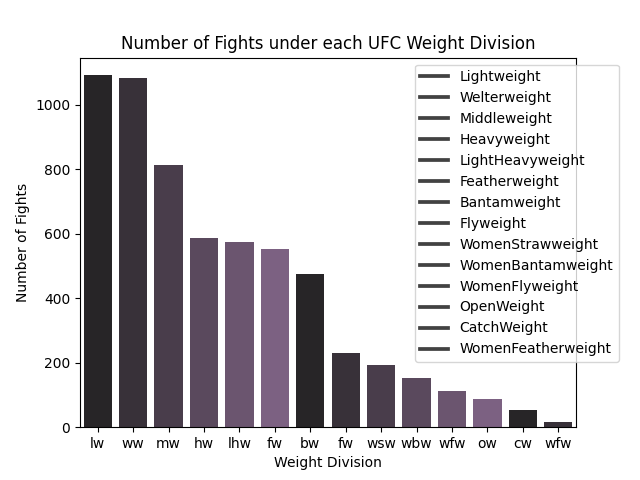

# COSC 301 - Data Analytics
### Group 20
### Team Members
- Zach Kelly 41637836
- Gerren Hunter
- Sarah Q
# UFC Fighter Statistics

## Introduction

This report considers a Ulitimate Fighting Championship (UFC) dataset. The data was scraped from the ufcstats website March 21st, 2021 and contains a list of statistics for every UFC fight in the history of the organization. Every row contains information about each fighter, fight details, and the winner. Provided this data the following research questions are considered:

- Which fighters have the most submission victories in the UFC?
- Does reach have a significant affect on fighter success in the UFC?
- What is the average fighter height amoung different UFC weight divisions?

These topics were motivated by our groups interest in mixed martial arts and the UFC. Answering research questions of these type help differentiate fighters and highlight their strengths or weaknesses.

## Exploratory Data Analysis

The raw dataset is stored in the form of a two dimensional dataframe and contains 6012 rows and 144 column entries. The rows descend in order according to most recent date. 106 columns have entries of type float, 28 columns have entries of type integer, 9 columns have entries of type object and 1 column has entries of type boolean. The competitors for each fight are classified as either Red or Blue. The information about the fighters will have a prefix "R" or "B" to clarify value assignment. For instance, column R_win_by_submission references the red fighter.

    
    Figure 1: first 5 rows of the raw dataset.
<p\>

Investigation of the win_by_submission columns using the .unique() function reveals that the columns only contains integer values in the range 0 to 14. This tells us we likely don't have to change any entry types or drop any rows in the submission columns. However, the .unique() function also revealed we have missing values in the height columns suggesting we will have to drop those corresponding rows if the analysis we're doing includes the height columns.

To assess potential bais in the dataset, the distribution of data should be considered. For instance, some weight divisions fight more frequently than others. To observe the number of fights in each weight divison a distribution was plotted.

    
    
Figure 2: barplot of the number of fights per weight division for the ufc dataset<p\>
<p\>

The above figure shows that the most number of recorded fights occur in the lightweight and welterweight divisions (>1000) and the least number of fights occur in the catchweight and womens featherweight divisions (<100).

Next let's take a look at the average reach for a UFC fighter to help us address the second quesiton. 
 

    
    
Figure 3: Average reach of a UFC fighter<p\>
<p\>
    
Here we can see that the average reach of a fighter is about 180cm 

To observe the values of fighter height in the ufc a distribution plot was created.

    
    
Figure 4: distribution plot of fighter height in centimeters for the ufc dataset<p\>
<p\>

The above figure shows that the average fighter height is approximately 183 centimeters across all weight divsions. It is important to note that the plot contains duplicate values of the same fighter (i.e. Donald Cerone has 36 fights meaning his height is accounted for 36 times). This introduces a bias to the height distributions toward the more active divisions. 

## Research Question 1: Which fighters have the most submission victories in the UFC?

To obtain only the data relevant to the most submission wins the red and blue instances of the fighter and submission columns were vertically stacked. To get the most number of submissions for each fighter, the first instance (most recent instance) of the fighter is kept and the remaining duplicates are removed. The resulting table is used to generate the following figures.

To view the distribution of submission wins over the entire dataset, the following plot is created.

    
    
Figure 4: plot of the fighters with x number of submission wins in the ufc<p\>
<p\>

To observe only the top percent of fighters and answers the research question of which fighter has the most submission victories, the following table was created.

    
    
Figure 5: ranking of fighters with the most submission wins in the ufc as of march 2021 <p\>
<p\>

## Research Question 2: Does reach have a significant affect on fighter success in the UFC?
    
Reach is an important metric used by UFC to determine the odds if a fighter will win a bout. In fact, it is so important, that a fighter's reach is mentioned when the announcer introduces fighters into each corner. The reason why reach is so important is because it helps fighters keeps their distance away at range. It is hard to fight a fighter that has a reach advantage because they can blow you up with combos before the other fighter has time to make distance. It is like they are forcing your hand to come in close. 
    
That being said, I would like to examine the effectiveness of a fighter's with real life quantative data. I want to use this data to see if there is any general trends to help me answer this quesiton. To do so, I am going to graph the number of wins that a fighter has against what their reach is, and see if there is any general trends. Here are my images below; each color seperating the red corner vs the blue corner. 
    

    
    
Figure 6 Plot of wins/reach of a fighter<p\>
<p\>
    

    
    
Figure 7: Plot of wins/reach of a fighter <p\>
<p\>
    
We have some interesting trends going on in the above figures. First I would like to point out that there is a general trend of reach being directly porportional to the amount of wins that a fighter has, but we have some caivats. At around 150cm we have a spike in the amount of wins that a fighter has with their reach, and inversely, we see a dramatic decrease in the amount of wins that a fighter has at about a reach of 205cm. 

    
## Research Question 3: What is the average fighter height amoung different UFC weight divisions?

To observe the how the data is weighted by weight class a figure below summarizes the number of fighters in each division. 

    
    
Figure 8: barplot of the count of fighters in each weight division <p\>
<p\>

The figure above addresses the error observed in the EDA, by keeping the first instance of a fighter and removing the remaining rows containing duplicates. This ensures that the fighters who have fought multiple times are only counted once, however neglects the case of the same fighter fighting in multiple weight divisions. If the same fighter has fought in multiple weight divisions we'd want add one count per weight division fought (i.e. if Charles Olivera fought in lightweight and welterweight division we'd want to add a count of 1 to the lightwieght and welterweight division). In the figures case, only the first instance is counted.

Figure 5 tells us that the most populated division is the lightweight division with more than 350 fighters and the least populated division is the womens featherweight division with less than 20 fighters.  

Now, we can take a look at particular weight divisions to see how fighter height are distributed. To obtain only the data relevant to reseach question 3 the red and blue instances of the fighter and height columns were vertically stacked. The height column entries are converted from centimeters to inches. The first instance of a fighter is kept and the remaining instances are removed to avoid over-counting. The resulting tables are plotted for different weight divisions.

    
    
Figure 9: barplot of fighter height in the ufc lightweight division <p\>
<p\>

The above figure shows that the most common fighter height in the lightweight division is 70 inches. The tallest being 76 inches and shortest being 65 inches.

    
    
Figure 10: barplot of fighter height in the ufc womens featherweight division <p\>
<p\>

The above figure shows that the most common fighter height in the womens featherweight division is 67 inches. The tallest being 71 inches and shortest being 66 inches.

## Conclusion

